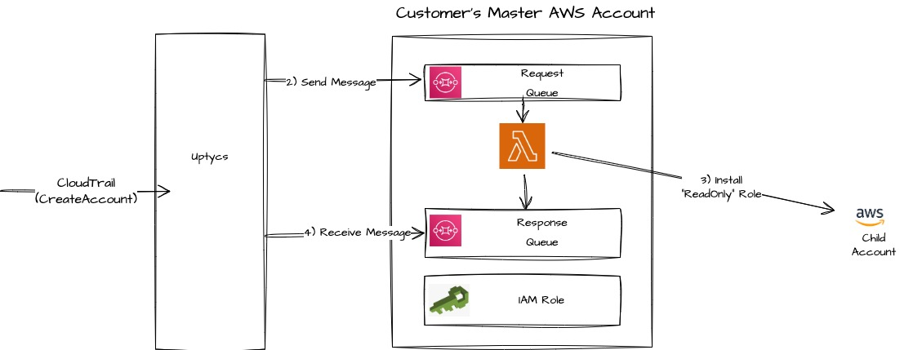

# Terraform module for AWS Org. Integration with Uptycs

This module allows you to integrate AWS master account with Uptycs so required AWS telemetry is accessible to CSPM and CIEM applications.

After AWS Master Account is integrated with Uptycs, any AWS Child accounts under Organization are automatically integrated (More on this later).

## Resources created by this module

* IAM Role in master account. The role has following policies attached
  * `policy/job-function/ViewOnlyAccess`
  * `policy/SecurityAudit`
  * `Read-Only (Customer Inline)` policy for required resources
  * SQS Permissions - Access limited to the SQS Queues created by this module
  * (Optional) S3 Object Read permissions to allow access to CloudTrail events
* SQS Queues - 2
  * Request Queue (with Dead letter queue)
  * Response Queue (with Dead letter queue)
* Lambda Function - 1
  * On trigger, from SQS request queue, it will create an IAM Role in requested child account by attaching the following policies:
    * `policy/job-function/ViewOnlyAccess`
    * `policy/SecurityAudit`
    * `Read-Only (Customer Inline)`
    * (Optional) S3 Object Read permissions to allow access to CloudTrail events if s3 bucket is in child account
  * This triggered once for all child accounts

## Child Account integration

This module also takes care of on-boarding AWS Accounts under the organizations. There is no need to re-apply terrafrom configuration to on-board any newly created child AWS accounts.

### Overview of child-account on-boarding



## Prerequisites

- Requires Terraform version >= 1.2.0
- The user should have Admin access on the master account
- Every child account in the organization should have `OrganizationAccountAccessRole` role.

## Usage

### Set Profile and Region before execute terraform

```sh
export AWS_PROFILE="< profile name >"
export AWS_DEFAULT_REGION="< pass region >"
```

### Copy and paste the following configuration into a .tf file (ex: main.tf) and modify the values as required

```
module "org-config" {
  source           = "github.com/uptycslabs/terraform-aws-org-integration"

  # Modify as you need, this will be used to name the resources
  integration_name = "UptycsIntegration"

  # Copy Uptycs Account ID into 'upt_account_id'
  # Look for "Uptycs Account ID" at the top right corner of the Uptycs Console
  # Uptycs' UI: "Cloud"->"AWS"->"Integrations"->"ORG INTEGRATION"
  upt_account_id = "<upt_account_id>"

  # Organization's master account ID 
  aws_account_id = "<aws_account_id>"

  # Copy the suggested UUID from Uptycs UI
  external_id = "<uuid4>"

  # Following bucket and stream configurations are optional
  # Inorder to ingest organization CloudTrail logs you need to set either `cloudtrail_s3_bucket_name` or `kinesis_stream_name`
  # Provide the resource's regions if these are diiferent from default region

  # Specify whether the given cloudtrail S3 bucket is in master account or not (true/false)
  cloudtrail_s3_bucket_in_master = true

  # Provide the S3 bucket name and region which contains the CloudTrail data
  # Ignore this field in case the CloudTrail S3 bucket is in a child account
  cloudtrail_s3_bucket_name = ""
  cloudtrail_s3_bucket_region = ""

  # Please make sure to provide all necessary CloudTrail bucket information on the Uptycs Integrations page, after successfully running the Terraform script.

  # Name of the Kinesis stream configured to stream CloudTrail data
  kinesis_stream_name = ""
  # The region where the kinesis stream exists
  kinesis_stream_region = ""

  # Name of the S3 bucket in the master account that contains the VPC flow logs
  vpc_flowlogs_bucket_name = ""
  # The region where the vpc flow log bucket exists
  vpc_flowlogs_bucket_region = ""

}

output "aws_parameters" {
  value = module.org-config.aws_parameters
}

```

### Inputs explained


| Name                           | Description                                                            | Type     | Default             | Required |
| -------------------------------- | ------------------------------------------------------------------------ | ---------- | --------------------- | ---------- |
| integration_name               | Prefix to be used for naming new resources                             | `string` | `UptycsIntegration` |          |
| upt_account_id                 | Uptycs Account ID                                                      | `string` | `""`                | Yes      |
| aws_account_id                 | AWS organization's master account ID                                   | `string` | `""`                | Yes      |
| external_id                    | External ID                                                            | `uuid4`  | `""`                | Yes      |
| vpc_flowlogs_bucket_name       | Name of the S3 bucket in master for VPC flow logs                      | `string` | `""`                | Optional |
| vpc_flowlogs_bucket_region     | The region where the vpc flow logs bucket exists                       | `string` | `""`                | Optional |
| cloudtrail_s3_bucket_name      | Name of the organization cloud trail S3 bucket                         | `string` | `""`                | Optional |
| cloudtrail_s3_bucket_region    | The region where the cloudtrail bucket exists                          | `string` | `""`                | Optional |
| cloudtrail_s3_bucket_in_master | Specifies whether the cloudtrail s3 bucket is in master account or not | `bool`   | `true`              |          |
| kinesis_stream_name            | Name of the organization Kinesis stream                                | `string` | `""`                | Optional |
| kinesis_stream_region          | The region where the kinesis stream exists                             | `string` | `""`                | Optional |

### Execute Terraform script

```sh
$ terraform init -upgrade
$ terraform plan
$ terraform apply
```

Notes:-

- If you see this error you need to add the missing role `OrganizationAccountAccessRole` on the child account. For more information visit: [https://docs.aws.amazon.com/organizations/latest/userguide/orgs_manage_accounts_access.html]

```
Unable to create uptycscspm role. err=operation error IAM: CreateRole, failed to sign request: failed to retrieve credentials: failed to refresh cached credentials, operation error STS: AssumeRole, https response error StatusCode: 403, RequestID: 262297b8-c6e5-4dec-b1ec-3fcaa7e8e6da, api error AccessDenied: User: arn:aws:iam::<masterAccountId>:user/<user> is not authorized to perform: sts:AssumeRole on resource: arn:aws:iam::<childAccountId>:role/OrganizationAccountAccessRole
```

### Outputs


| Name           | Description                                     |
| ---------------- | ------------------------------------------------- |
| aws_parameters | AWS parameters (ExternalId and IntegrationName) |

### Navigate back to Uptycs

Navigate back to Uptycs Organizations Integration page to complete the integration process.
